&emsp;&emsp;[上一篇](http://beader.me/2014/01/15/is-learning-feasible/)讲到，learning的时候如果遇上bad sample，如果遇上bad sample我们就无法保证$E\_{in}$和$E\_{out}$很接近。我们用了一个不等式来衡量遇上bad sample的概率：

$$\mathbb{P}_\mathcal{D}[BAD\ D]\leq 2Mexp(-2\epsilon ^2N)$$

<!--more-->
&emsp;&emsp;因此如果Hypothesis Set中方程的数量$|\mathcal{H}|=M$是有限个，并且N足够大的时候，我们就有很大的概率保证不会遇上bad sample，即不管$\mathcal{A}$挑选了任意一个$g$，都可以保证$E\_{out}(g) \approx E\_{in}(g)$。因此learning的问题可以聚焦到以下两个问题：

1. 能不能确保$E\_{in}(g)$和$E\_{out}(g)$很接近？(Hypothesis Set中方程的个数会不会太多，用来训练的数据量够不够大)
2. 能不能使$E\_{in}(g)$足够小？(Hypothesis Set中方程的个数会不会太少)  

&emsp;&emsp;这里我们便遇到了一个两难的选择：

 - 如果M很小，根据$\mathbb{P}[BAD]\leq 2Mexp(...)$，第1个问题，“很接近”，做的不错。但是对于第2个问题，由于选择性太少，很难找到$E\_{in}(g)$较小的$g$。(想象一下如果数据是由一个二次方程所产生，而Hypothesis Set当中只有直线方程可以选)
 - 如果M很大，我们选择方程的时候更加自由(自由度)，更有机会选到$E\_{in}$很低的方程。但这个时候根据公式，我们遇到bad sample的可能性也大大增加。

&emsp;&emsp;因此这篇笔记主要围绕公式中这个$M$展开：

$$\mathbb{P}[| E\_{in}(g) - E\_{out}(g) | \gt \epsilon] \leq 2\cdot M \cdot exp(-2\epsilon ^2N)$$

## 有效的方程 (Effective Number of Hypotheses)

&emsp;&emsp;让我们来回忆下这个M是从哪里来的。记$\mathcal{H}$中第m个方程遇到bad sample为事件$\mathcal{B}\_m:|E\_{in}(h\_m) - E\_{out}(h\_m)| \gt \epsilon$，则$\mathcal{H}$遇到bad sample的概率为其所有方程遇到bad sample概率的联合概率。如果每个方程遇上bad sample这件事是互相独立的，则$\mathcal{H}$遇上bad sample的概率是各方程遇上bad sample的概率之和，因此他们的联合概率一定小于等于各个事件单独发生的概率之和。

$$\mathbb{P}[\mathcal{B}\_1 or \mathcal{B}\_2 or ... or \mathcal{B}\_M] \leq \mathbb{P}[\mathcal{B}\_1] + \mathbb{P}[\mathcal{B}\_2] + ... + \mathbb{P}[\mathcal{B}\_M]$$

&emsp;&emsp;但事实上bad event并不是完全独立的。想象$\mathcal{H}$两个非常类似的方程$h\_1\approx h\_2$，他们遇到bad sample分别为事件$\mathcal{B}\_1$与$\mathcal{B}\_2$，因为这两个方程很接近，则往往$\mathcal{B}\_1$发生时，$\mathcal{B}\_2$也会发生，可以说$\mathcal{B}\_1$与$\mathcal{B}\_2$的重合度很高(overlapping)。

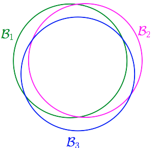  

&emsp;&emsp;那么我们就会想，我们能不能把结果接近的那些方程看成一类，譬如有些方程他们的预测结果总是相同或是很接近的。

&emsp;&emsp;假设我们的算法要在平面上挑选一条直线方程作为$g$,$\mathcal{H}=\{all\ lines\ in\  \mathbb{R}^2\}$，$\mathcal{H}$当中有无限多个方程，但我们可以把这些个方程归为两类。一类是把$x\_1$判断成圈圈的，另一类是把$x\_1$判断为叉叉的。

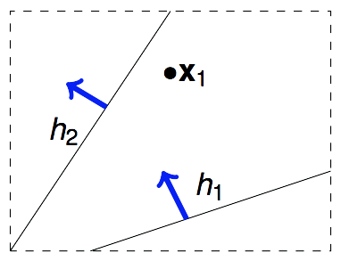  

&emsp;&emsp;那如果我们手中有2个数据点$x\_1$和$x\_2$呢？这样的话$\mathcal{H}$中无数条直线可以分为4类。用这4类线对$x\_1$和$x\_2$进行预测，一共能产生4种不同的结果。

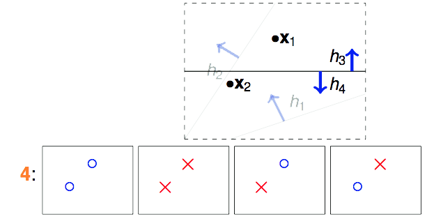  

&emsp;&emsp;那如果我们手中有3个数据点$x\_1$、$x\_2$和$x\_3$呢？

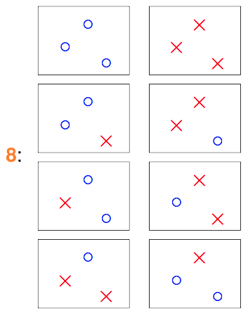  

&emsp;&emsp;$\mathcal{H}$中最多有8类直线，作用于$\mathcal{D}$产生如上8种结果。

&emsp;&emsp;那如果我们手中有4个数据点$x\_1$~$x\_4$，情况又会是怎样。前面的例子中我们基本上把各个数据点的情况用排列组合的方式组合出来即可。但对于4个以上的点而言，就不是那么容易了。

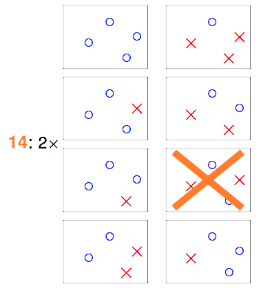  
&emsp;&emsp;在这16种组合中，就有两种是“直线方程”没有办法产生的结果。因此如果$\mathcal{H}$是2维空间中的所有直线，表面上看是在无数条直线方程中去挑，但由于大部分直线方程所产生的结果是一模一样的，结果不一样的直线的类别对应上面的例子分别为2类、4类、8类和14类(Effective Number of Lines)。属于同一类的直线，他们将同时遇到或不遇到bad sample，由于之前那个union bound是基于独立性的假设下的，因此$\mathcal{H}$遭遇bad sample的概率明显被夸大了。所以，我们应该把不等式改写为：

$$\mathbb{P}[|E\_{in}(g)-E\_{out}(g)|\gt \epsilon]\leq 2\cdot effective(N)\cdot exp(-2\epsilon^2N)$$

## $\mathcal{H}$作用于$\mathcal{D}$能够产生多少不同的结果？ (Dichotomies)

&emsp;&emsp;从$\mathcal{H}$中任意选取一个方程$h$，让这个$h$对$\mathcal{D}$进行二元分类，输出一个结果向量，比如对4个点进行预测，输出$\{\mathrm{o},\mathrm{o},\mathrm{o},\times\}$，这样的一个输出向量我们称它为一个dichotomy。不难得出，一个直线方程在$\mathcal{D}$中对应一个dichotomy，但一个dichotomy至少对应一个直线方程，我们把一个dichotomy对应的所有直线方程视为一类，则effective number of lines就等于不同$\mathcal{D}$中不同的dichotomy的数量。显然这个dichotomy的数量小于等于所有数据点的排列组合数的，例如上图中画大叉的那幅图对应的排列组合，就不能成为一个dichotomy，因为它们无法由任何一条直线方程产生。（当然如果考虑的不是直线方程，则那种排列组合是可以成为一种dichotomy的）  
&emsp;&emsp;因此我们前面要找的  
&emsp;&emsp;$effective(N)$  
&emsp;&emsp;&emsp;&emsp;&emsp;&emsp;=平面中能找出多少条不同类的直线  
&emsp;&emsp;&emsp;&emsp;&emsp;&emsp;=$\mathcal{H}$作用于$\mathcal{D}$能产生多少不同的dichotomy。  
&emsp;&emsp;因为不一定所有排列组合都能成为dichotomy，所以不同的dichotomy的数量一定不会超过排列组合数$2^N$，上例中如果存在三点共线的情况，则dichotomy的数量会更少，因此：  
&emsp;&emsp;$effective(N)$  
&emsp;&emsp;&emsp;&emsp;&emsp;&emsp;=$\mathcal{H}$作用于$\mathcal{D}$“**最多**”能产生多少不同的dichotomy

## 成长函数 (Growth Function)

&emsp;&emsp;那么，$\mathcal{H}$作用于$\mathcal{D}$“**最多**”能产生多少种不同的dichotomy呢？这个数量与$\mathcal{H}$有关，也与数据量$N$有关。用数学式可以表达为：

$$max|\mathcal{H}(x\_1,x\_2,...,x\_N)|$$

&emsp;&emsp;上式又称为成长函数（growth function）。在$\mathcal{H}$确定的情况下，growth function是一个与N相关的函数。以下是几种常见的Hypothesis Set的成长函数。

 1. Positive Rays  
    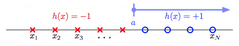  
    输入空间为一维实数空间。大于threshold a的预测+1,否则预测-1。
    for example: 当N=4时，Positive Rays作用于$x\_1$~$x\_4$，共能产生5个不同的dichotomies。如下图：  
    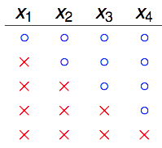  
    不难去想，4个点，5个可能的切点，最多产生5种dichotomies。因此Positive Rays的成长函数为：
    $$m\_{\mathcal{H}(N)}=N+1$$

 2. Positive Intervals  
    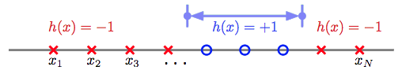  
    和前面的类似，只不过Positive Intervals有两个threshold，夹在两个threshold之间的预测为+1，其余预测为-1。
    for example: 当N=4时，Positive Intervals作用于$x\_1$~$x\_4$，共能产生11种dichotomies。如下图：  
    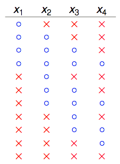  
    同样不难去想，4个点，5个可能的切点选两个作为threshold，加上两个threshold重合产生的一种，因此Positive Intervals的成长函数为：
    $$m\_{\mathcal{H}(N)}=\binom{N+1}{2} + 1 = \frac{1}{2}N^2 + \frac{1}{2}N + 1$$

 3. Convex Sets  
    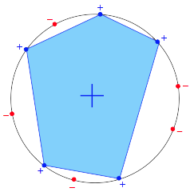  
    任选k个点，在这k个点组成的convex多边形包围内的所有点都预测+1，否则预测-1。前面我们说到成长函数描述的是“**最多**”能产生的dichotomy种数，因此如果我们这N个input摆成一个圈，则这N个点的任意一种排列组合都能成为一个dichotomy。因此Convex Sets的成长函数为：
    $$m\_{\mathcal{H}(N)}=2^N$$

## 坏掉的散弹枪 (Shatter & Break)

&emsp;&emsp;当$\mathcal{H}$作用于有N个inputs的$\mathcal{D}$时，产生的dichotomies数量等于这N个点的排列组合数$2^N$时，我们就称这N个inputs被$\mathcal{H}$给shatter掉了。或者也可以说$\mathcal{H}$产生的$2^N$个dichotomies把这N个点的$2^N$种排列组合给shatter了。

&emsp;&emsp;这个shatter的意思似乎不太好理解，这是林老师在讨论区中的回复：

&emsp;&emsp;“大家對 break point 的討論很好，不過注意到 shatter 的原意是「打碎」，在此指「N 個點的所有(碎片般的)可能情形都被$\mathcal{H}$產生了」。所以$m\_{\mathcal{H}}(N)=2^N$ 的情形是「shatter」。”

&emsp;&emsp;我从打游戏过关的角度去理解，shatter作打碎理解：

&emsp;&emsp;“$m\_{\mathcal{H}}$是把散弹枪，在每个关卡(level N)中，他可以有$m\_{\mathcal{H}}(N)$发小子弹（每发小子弹对应一种dichotomy），而你面临的是$2^N$个敌人。你得一枪打出去shatter掉所有人。对于$m\_{\mathcal{H}}(N)=2N$这把散弹枪来说，第一关和第二关都还好，第三关6发小子弹shatter不掉8个人，于是它就break了。”

&emsp;&emsp;对于给定的成长函数$m\_{\mathcal{H}}(N)$，从$N=1$出发，N慢慢增大，当增大到k时，出现$m\_{\mathcal{H}}(k)\lt 2^k$的情形，则我们说k是该成长函数的break point，对于任何$N \gt k$个inputs而言，$\mathcal{H}$都没有办法再shatter他们。

&emsp;&emsp;不难根据成长函数得出Positive Rays成长函数的break point为2，Positive Intervals成长函数的break point为3，Convex Sets不管N多大都可以去shatter掉那N个点，因此它的成长函数没有break point。2D Perceptrons的break point为4，因为在N=3时，它都能够shatter，产生$2^3=8$种dichotomies，当N=4时，它不能够shatter，最多只能产生14 ($\lt 2^4 = 16$) 种dichotomies，因此2D Perceptrons成长函数的break point为4。

## 拿什么来镇镇成长函数 (Restriction of Break Point)

&emsp;&emsp;有些$\mathcal{H}$的成长函数很容易找到，比如前面说到的Positive Rays、Positive Intervals以及Convex Sets；有些$\mathcal{H}$则没有那么容易，比如2D perceptrons，我们无法直接看出它的成长函数是什么，那么我们对于这样的$\mathcal{H}$就没辙了吗？也不完全是，至少我们手上还掌握着它的break point，能不能用这个break point干点事呢？如果没办法得到成长函数，能得到成长函数的upper bound也是不错的。

&emsp;&emsp;先用例子来看看，当我们完全不知道$\mathcal{H}$是什么，只知道它的break point k时，$\mathcal{H}$作用于$\mathcal{D}$“**最多最多**”可以产生多少这dichotomies。注意这里我用了两个“**最多**”，由于我们无法确切知道成长函数，因此我们用这个break point推算出的这个dichotomies的数量仍然是个高估值，这个高估值实际上是任何break point为k的$\mathcal{H}$作用于$\mathcal{D}$所真实产生的dichotomies数量的上界 (upper bound)。

&emsp;&emsp;举例说明，假设我们不知道某个$\mathcal{H}$的成长函数$m\_{\mathcal{H}}(N)$，但知道它的break point k=2，那么$\mathcal{H}$作用于N=3的$\mathcal{D}$时，“**最多最多**”能产生多少种dichotomies？

&emsp;&emsp;从k=2我们可以知道，任意2个数据点都不能被shatter。还记得shatter的概念吗？意思就是我产生的dichotomies不能完全包含任何2个数据点所有的排列组合。让我们从1个dichotomy开始。

1 dichotomy 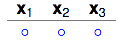

2 dichotomies 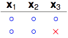

3 dichotomies 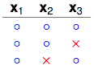

&emsp;&emsp;注意看$x\_2$和$x\_3$这两列，这3个dichotomies已经包含$x\_2$和$x\_3$这两个点所有的4种排列组合中的3种了。再多加一种，$x\_2$、$x\_3$就会被shatter。

4 dichotomies 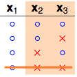

&emsp;&emsp;看右边两列，$x\_2$和$x\_3$被shatter了。但之前说了k=2，即任意2个点不能被shatter，因此不可能产生这4种dichotomies。那我们换一个dichotomy试试看。

4 dichotomies 

&emsp;&emsp;换了一个dichotomy之后就行了，右边2列只包含了$x\_2$、$x\_3$所有排列组合4种中的3种，因此那两个点没有被shatter。继续检查任意的两个点($x\_1$、$x\_2$)，($x\_1$、$x\_3$)，都没有被shatter，看来这4种dichotomies是可以的。

&emsp;&emsp;5个dichotomies的情形这里就不再画出来了，很容易看出不管增加怎样的dichotomy进去，都会有两个点被shatter掉。因此这里“**最多最多**”只能有4种dichotomies。因此$N=3$，$k=2$时的upper bound是4。我们用$B(N,k)$来表示break point为k的任意的$\mathcal{H}$作用于size为N的任意的$\mathcal{D}$所能产生的dichotomies的数量的上限（“**最多最多**”）。则刚刚得出的结论可以表示为$B(3,2)=4$，因为任意2个数据点不能被shatter，因此当$N=2,K=2$时，$B(2,2)\lt 4$，因此最多最多有$B(2,2)=3$。

&emsp;&emsp;美妙的地方马上就要到了，虽然很多时候我们无法直接得到成长函数$m\_{\mathcal{H}}(N)$，但如果我们知道它的break point是多少，我们似乎还是有办法算出这个$m\_{\mathcal{H}}(N)$的上界$B(N,k)$的。于是乎我们就有了新的目标，不去直接研究$m\_{\mathcal{H}}(N)$，转而去研究$B(N,k)$。

&emsp;&emsp;前面我们已知了$B(2,2)=3$，$B(3,2)=4$。不难知道：

 - $k=1$时，1个点(2种排列组合)都没有办法shatter，因此$B(?,1)$恒等于1。
 - $k>N$时，$\mathcal{H}$一定能shatter掉$N$个点，因此它产生的dichotomies的种类等于这$N$个点所有的排列组合数$2^N$。
 - $k=N$时，从$2^N$个排列组合中移除掉一个，剩下的都可以作为dichotomies，因此它产生的dichotomies的数量“**最多最多**”可以是$2^N-1$。

&emsp;&emsp;因此我们可以得到下表：

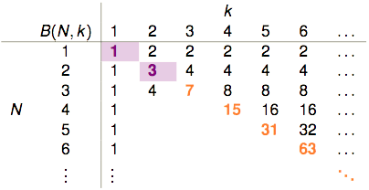
 
&emsp;&emsp;表格剩余的部分该如何填补？$B(4,3)$是否与$B(3,?)$有关呢？  
&emsp;&emsp;此时某某实验室帮老师抛硬币的研究生要上场了，他穷举了所有可能的dichotomies，发现$B(4,3)=11$，以下是他的研究成果：

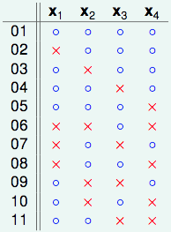

&emsp;&emsp;我们把这份结果做个排序：

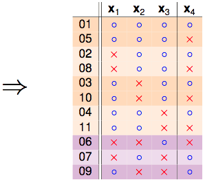

&emsp;&emsp;发现秘密了没有，橙色的部分是成对出现的，只有紫色的部分是单独出现的：

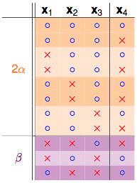 

 1. 如果拿掉$x\_4$，只看$x\_1,x\_2,x\_3$这3个点：  
 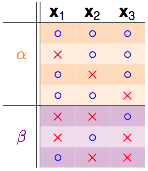  
&emsp;&emsp;$\alpha + \beta$部分可以成为这3个点的dichotomies，因为$k=3$，所以任3个点不能够被shatter，因此有：：
$$\alpha + \beta \leq B(3,3)$$

 2. 再来看剩下一个$\alpha$的部分：  
 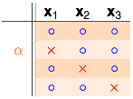  
&emsp;&emsp;注意$\alpha$是之前成对存在的部分，并且$\alpha$部分不可以shatter掉任意2个点，因为如果$\alpha$部分的dichotomies可以shatter掉任意2个点，他每一行都再搭配$x\_4$的两种情况，这样产生的dichotomies就能shatter掉3个点了，和break point为3相违背。所以$\alpha$不能shatter掉任2个点。因此有：
$$\alpha \leq B(3,2)$$

&emsp;&emsp;综合上面两个不等式，我们可以得到：
$$B(4,3)=2\alpha + \beta \leq B(3,3) + B(3,2)$$

&emsp;&emsp;这样就能够把前面那张表给填完整：

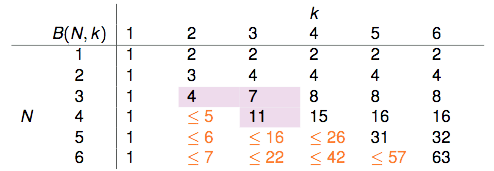

&emsp;&emsp;用数学归纳法可以证明：
$$B(N,k)\leq \sum_{i=0}^{k-1}\binom {N}{i}$$

&emsp;&emsp;当$k=1$时不等式恒成立，因此只要讨论$k\geq 2$的情形。$N=1$时，不等式成立，假设$N\leq N\_{o}$时对于所有的$k$不等式都成立，则我们需要证明当$N=N\_{o}+1$时，不等式也成立。根据前面得到的结论，有：

&emsp;&emsp;因此当$N=N\_{o}+1$时，不等式也成立。

&emsp;&emsp;成长函数的上界-$B(N,k)$都被bound住了，那我们的成长函数同样也可以被这个bound住，因此对于存在break point k的成长函数而言，有：
$$m\_{\mathcal{H}}\leq \sum\_{i=0}^{k-1}\binom {N}{i}$$
&emsp;&emsp;By the way，右手边(RHS)实际上是一个最高次项为k-1次的多项式。以2D Perceptrons为例，它的break point $k=4$，则它的成长函数会被$B(N,4)$给bound住：
$$m\_{\mathcal{H}}\leq \sum\_{i=0}^{4-1}\binom {N}{i}=\frac{1}{6}N^3+\frac{5}{6}N+1$$

## 总结

&emsp;&emsp;上一篇说的learning的可行性，讲到，如果遇上bad sample，$E\_{in}(h)$与$E\_{out}(h)$就会差很多，此时learning不可行。遇到bad sample的概率与$\mathcal{H}$中方程的数量$M$以及$\mathcal{D}$中的数据量$N$有关。然而$\mathcal{H}$中方程的数量往往是无穷的(比如2D Perceptrons的$\mathcal{H}$是平面上所有的直线)，本篇则继续阐述，方程的数量看上去是无穷的，但真正有效(effective)的方程的数量却是有限的，我们可以用成长函数$m\_{\mathcal{H}}(N)$来描述$\mathcal{H}$作用于$\mathcal{D}$会产生多少种有效的方程。如果用有限的成长函数去代替无限的$M$，就有：

$$\mathbb{P}\_\mathcal{D}[BAD\ D]\leq 2m\_{\mathcal{H}}(N)\cdot exp(-2\epsilon ^2N)$$

&emsp;&emsp;但实际上我们很难确切知道各种$\mathcal{H}$的成长函数$m\_{\mathcal{H}}(N)$究竟长什么样子，我们只好通过break point去寻找成长函数的upper bound。不过这当中仍然有些情况没有考虑到，将在下一篇笔记中继续说明。
