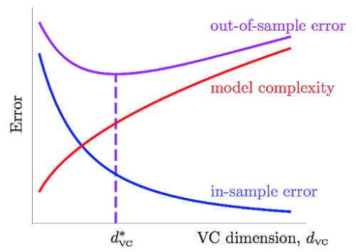

笔记整理自台大林轩田老师的开放课程-[机器学习基石](https://www.coursera.org/course/ntumlone)，笔记中所有图片来自于课堂讲义。

&emsp;&emsp;[上一篇](http://beader.me/2014/02/15/vc-dimension-two/)讲到了VC Dimension以及VC Bound。VC Bound所描述的是在给定数据量N以及给定的Hypothesis Set的条件下，遇到坏事情的概率的上界，即$$E_{in}$$与$$E_{out}$$差很远的概率，最多是多少。VC Bound用公式表示就是：

$$
\begin{aligned}
\mathbb{P}[BAD] &= \mathbb{P}[\exists h \in \mathcal{H}\text{ s.t. } |E_{in}(h)-E_{out}(h)|\gt \epsilon] \\\
&\leq 4m_{\mathcal{H}}(2N)exp(-\frac{1}{8}\epsilon^2N)
\end{aligned}
$$

<!--more-->
&emsp;&emsp;其中$$m_{\mathcal{H}}(N)$$为Hypothesis Set的成长函数，有：

$$
\begin{aligned}
\\m_{\mathcal{H}}(N)\leq \sum_{i=0}^{d_{vc}}\binom {N}{i}\leq N^{d_{vc}} \\\
\textit{( for }N\geq 2, d_{vc}\geq 2\textit{ )}
\end{aligned}
$$

&emsp;&emsp;因为寻找所有Hypothesis Set的成长函数是困难的，因此我们再利用$$N^{d_{vc}}$$来bound住所有VC Dimension为$$d_{vc}$$的Hypothesis Set的成长函数。所以对于任意一个从$$\mathcal{H}$$中的$$g$$来说，有：

$$
\begin{aligned}
&\;\;\;\,\mathbb{P}[|E_{in}(g) - E_{out}(g)\gt \epsilon|] \\\
&\leq \mathbb{P}[BAD]\\\
&= \mathbb{P}[\exists h \in \mathcal{H}\text{ s.t. } |E_{in}(h)-E_{out}(h)|\gt \epsilon] \\\
&\leq 4m_{\mathcal{H}}(2N)exp(-\frac{1}{8}\epsilon^2N) \\\
&\leq 4(2N)^{d_{vc}}exp(-\frac{1}{8}\epsilon^2N) \\\
&\textit{( if }d_{vc}\textit{ is finite )}
\end{aligned}
$$

&emsp;&emsp;因此说想让机器真正学到东西，并且学得好，有三个条件：

 1. $$\mathcal{H}$$的$$d_{vc}$$是有限的，这样VC Bound才存在。(good $$\mathcal{H}$$)
 2. $$N$$足够大(对于特定的$$d_{vc}而言$$)，这样才能保证上面不等式的bound不会太大。(good $$\mathcal{D}$$)
 3. 算法$$\mathcal{A}$$有办法在$$\mathcal{H}$$中顺利地挑选一个使得$$E_{in}$$最小的方程$$g$$。(good $$\mathcal{A}$$)

&emsp;&emsp;为什么要费那么大的力气来讲这个VC Bound和VC Dimension呢？因为对于初学者来说，最常犯的错误就是只考虑到了第3点，而忽略掉了前两点，往往能在training set上得到极好的表现，但是在test set中表现却很烂。关于算法$$\mathcal{A}$$的部分会在后续的笔记当中整理，目前我们只关心前面两点。

## 几种Hypothesis Set的VC Dimension

&emsp;&emsp;对于以下几个$$\mathcal{H}$$，由于之前我们已经知道了他们的成长函数(见[机器学习笔记-VC Dimension, Part I](http://beader.me/2014/01/23/vc-dimension-one/))，因此可以根据$$m_{\mathcal{H}}(N)\leq N^{d_{vc}}$$，直接得到他们的VC Dimension：

 - positive rays: $$m_{\mathcal{H}}(N)=N+1$$，看N的最高次项的次数，知道$$d_{vc}=1$$
 - positive intervals: $$m_{\mathcal{H}}(N)=\frac{1}{2}N^2+\frac{1}{2}N+1$$，$$d_{vc}=2$$
 - convex sets: $$m_{\mathcal{H}}(N)=2^N$$，$$d_{vc}=\infty$$
 - 2D Perceptrons: $$m_{\mathcal{H}}(N)\leq N^3\;for\;N\geq 2$$，所以$$d_{vc}=3$$

&emsp;&emsp;由于convex sets的$$d_{vc}=\infty$$，不满足上面所说的第1个条件，因此不能用convex sets这个$$\mathcal{H}$$来学习。

&emsp;&emsp;但这里要回归本意，通过成长函数来求得$$d_{vc}$$没有太大的意义，引入$$d_{vc}$$很大的一部分原因是，我们想要得到某个Hypothesis Set的成长函数是困难的，希望用$$N^{d_{vc}}$$来bound住对应的$$m_{\mathcal{H}}(N)$$。对于陌生的$$\mathcal{H}$$，如何求解它的$$d_{vc}$$呢？

## 某个$$\mathcal{H}$$的VC Dimension - 从"shatter"的角度

&emsp;&emsp;Homework当中的某题，求解简化版决策树的VC Dimension：

Consider the **simplified decision trees** hypothesis set on $$\mathbb{R}^d$$, which is given by

$$
\begin{aligned}
\mathcal{H} = \{&h_{t,S}\; |\; h_{t,S} = 2[v \in S] - 1, \text{where } v_i=[x_i\gt t_i], \\\
&\textbf{S}\text{ is a collection of vectors in }\{0,1\}^d, \textbf{t}\in \mathbb{R}^d \}
\end{aligned}
$$

That is, each hypothesis makes a prediction by first using the $$d$$ thresholds $$t_i$$ to locate $$x$$ to be within one of the $$2^d$$ hyper-rectangular regions, and looking up $$S$$ to decide whether the region should be +1 or −1. What is the VC-dimension of the **simplified decision trees** hypothesis set?

&emsp;&emsp;如何去理解题意呢？用一个2维的图来帮助理解：

&emsp;&emsp;首先把二维实数空间$$\mathbb{R}^2$$中的向量$$x$$，通过各个维度上的阈值$$t_i$$，转换到$${\{0,1\}}^2$$空间下的一个点$$v$$，规则为$$v_i=[x_i\gt t_i]$$。譬如对于$$t=[5,10]$$，$$x=[6,8]$$可以转换为新的空间下的$$[1,0]$$。这样一来，原来的$$\mathbb{R}^2$$空间就可以被划分为4个区块$$S_1$$~$$S_4$$（hyper-rectangular regions）。$$\mathcal{H}$$中每一个方程$$h$$代表着一种对这4块区域是”圈圈“还是”叉叉“的决策(decision)，并且这4块区域的决策是互相独立的，$$S_1$$的决策是”圈圈“还是”叉叉“和$$S_2,S_3,S_4$$都没有关系。

&emsp;&emsp;由于这4块区域的决策是互相独立的，那么它最多最多能shatter掉多少个点呢？4个，(当这4个点分别属于这4块区域的时候)，即这4块hyper-rectangular regions所代表的类别可以是(o,o,o,o)、(o,o,o,x)、(o,o,x,o)、...、(x,x,x,x),共16种可能，因此它能够shatter掉4个点。

&emsp;&emsp;由上面2维的例子我们可以看出，**simplified decision trees**的VC Dimension，等于hyper-rectangular regions的个数。$$d$$维空间$$\mathbb{R}^d$$可以用$$d$$条直线切分出$$2^d$$个互相独立的hyper-rectangular regions，即最多最多可以shatter掉$$2^d$$个点，因此**simplified decision trees**的$$d_{vc}=2^d$$。

&emsp;&emsp;我们再来回顾一下Positive Intervals： 

&emsp;&emsp;也可以按照上面的方法去理解，Positive Intervals有两个thresholds，把直线切分为3块空间。但这3块空间并不是相互独立，中间的部分永远是+1，左右两边永远是-1，所以还要具体看它能够shatter掉多少个点，这里最多最多只能shatter掉2个点，它的$$d_{vc}=2$$。

## 某个$$\mathcal{H}$$的VC Dimension - 从"自由度"的角度

&emsp;&emsp;对于$$d_{vc}$$较小的$$\mathcal{H}$$，可以从它最多能够shatter的点的数量，得到$$d_{vc}$$，但对于一些较为复杂的模型，寻找能够shatter掉的点的数量，就不太容易了。此时我们可以通过模型的自由度，来近似的得到模型的$$d_{vc}$$。

&emsp;&emsp;维基百科上有不止一个关于自由度的定义，每种定义站在的角度不同。在这里，我们定义自由度是，模型当中可以自由变动的参数的个数，即我们的机器需要通过学习来决定模型参数的个数。

&emsp;&emsp;譬如：
 - Positive Rays，需要确定1个threshold，这个threshold就是机器需要根据$$\mathcal{D}$$来确定的一个参数，则Positive Rays中自由的参数个数为1，
 - Positive Intervals，需要确定左右2个thresholds，则可以由机器自由决定的参数的个数为2，$$d_{vc}=2$$
 - d-D Perceptrons，$$d$$维的感知机，可以由机器通过学习自由决定的参数的个数为$$d+1$$（别忘了还有个$$w_0$$），$$d_{vc}=d+1$$

## 多个$$\mathcal{H}$$的并集的VC Dimension

&emsp;&emsp;Homework当中某题，求$$K$$个Hypothesis Set的并集$$d_{vc}(\cup_{k=1}^{K}\mathcal{H}_k)$$的VC Dimension的上下界。下界比较好判断，是$$max\\{d_{vc}(\mathcal{H}_k)\\}_{k=1}^K$$，即所有的$$\mathcal{H}$$都包含于$$d_{vc}$$最大的那个$$\mathcal{H}$$当中的时候。上界则出现在各个$$\mathcal{H}$$互相都没有交集的时候，我们不妨先来看看$$K=2$$的情况：

&emsp;&emsp;求$$d_{vc}(\mathcal{H}_1\cup \mathcal{H}_2)$$的上界，已知$$d_{vc}(\mathcal{H}_1)=d_1$$，$$d_{vc}(\mathcal{H}_2)=d_2$$。

&emsp;&emsp;从成长函数上看，有 $$m_{\mathcal{H}_1\cup \mathcal{H}_2}(N) \leq m_{\mathcal{H}_1}(N) + m_ {\mathcal{H}_2}(N)$$，把成长函数展开，有

$$
m _ {\mathcal{H}_1\cup \mathcal{H}_2}(N) \leq \sum _ {i=0} ^ {d_1} \binom{N}{i} + \sum _ {i=0} ^ {d_2} \binom{N}{i}
$$

&emsp;&emsp;用$$\binom{N}{i}=\binom{N}{N-i}$$替换RHS，有

$$
m _ {\mathcal{H}_1\cup \mathcal{H}_2}(N) \leq \sum _ {i=0} ^ {d_1} \binom{N}{i} + \sum _ {i=0} ^ {d_2} \binom{N}{N-i} \leq \sum _ {i=0} ^ {d_1} \binom{N}{i} + \sum _ {i=N-d_2} ^ {N} \binom{N}{i}
$$

&emsp;&emsp;我们可以尝试寻找下上面这个成长函数有可能的最大的break point，让$$N$$不断增大，直到出现$$m_{\mathcal{H}_1\cup \mathcal{H}_2}(N)\lt 2^N$$的时候，这个$$N$$就是break point。那么$$N$$要多大才够呢？

&emsp;&emsp;$$N=d_1$$够大吗？不够，因为：

$$
\sum _ {i=0} ^ {d_1} \binom{N}{i} + \sum _ {i=N-d_2} ^ {N} \binom{N}{i} = 2^N + \sum _ {i=N-d_2} ^ {N} \binom{N}{i} \gt 2^N
$$

&emsp;&emsp;$$N=d_1+d_2+1$$够大吗？还是不够，因为：

$$
\sum _ {i=0} ^ {d_1} \binom{N}{i} + \sum _ {i=N-d_2} ^ {N} \binom{N}{i} = \sum _ {i=0} ^ {d_1} \binom{N}{i} + \sum _ {i=d_1+1} ^ {N} \binom{N}{i} = 2^N
$$

&emsp;&emsp;$$N=d_1+d_2+2$$够大吗？够大了，因为：

$$
\sum _ {i=0} ^ {d_1} \binom{N}{i} + \sum _ {i=N-d_2} ^ {N} \binom{N}{i} = \sum _ {i=0} ^ {d_1} \binom{N}{i} + \sum _ {i=d_1+2} ^ {N} \binom{N}{i} = 2^N - \binom{N}{d_1+1} \lt 2^N
$$

&emsp;&emsp;所以$$m_{\mathcal{H}_1\cup \mathcal{H}_2}(N)$$的break point最大可以是$$d_1+d_2+2$$，此时$$d_{vc}(\mathcal{H}_1\cup \mathcal{H}_2)=d_1+d_2+1$$。

&emsp;&emsp;因此两个$$\mathcal{H}$$的并集的VC Dimension的上界为$$d_{vc}(\mathcal{H}_1)+d_{vc}(\mathcal{H}_2)+1$$。利用此方法，就很容易可以推出$$K$$个$$\mathcal{H}$$的并集的情况。

## 简单 v.s 复杂

&emsp;&emsp;[机器学习笔记-VC Dimension, Part I](http://beader.me/2014/01/23/vc-dimension-one/)一开始就提到，learning的问题应该关注的两个最重要的问题是：1.能不能使$$E_{in}$$与$$E_{out}$$很接近，2.能不能使$$E_{in}$$足够小。

 - 对于相同的$$\mathcal{D}$$而言，$$d_{vc}$$小的模型，其VC Bound比较小，比较容易保证$$E_{in}$$与$$E_{out}$$很接近，但较难做到小的$$E_{in}$$，试想，对于2D Perceptron，如果规定它一定要过原点($$d_{vc}=2$$)，则它就比没有规定要过原点($$d_{vc}=3$$)的直线更难实现小的$$E_{in}$$，因为可选的方程更少。2维平面的直线，就比双曲线($$d_{vc}=6$$)，更难实现小的$$E_{in}$$。
 - 对于相同的$$\mathcal{D}$$而言，$$d_{vc}$$大的模型，比较容易实现小的$$E_{in}$$，但是其VC Bound就会很大，很难保证模型对$$\mathcal{D}$$之外的世界也能有同样强的预测能力。

&emsp;&emsp;令之前得到的VC Bound为$$\delta$$，坏事情$$[|E_{in}(g)-E_{out}(g)|\gt \epsilon]$$发生的概率小于$$\delta$$，则好事情$$[|E_{in}(g)-E_{out}(g)|\leq \epsilon]$$发生的概率就大于$$1-\delta$$，这个$$1-\delta$$在统计学中又被称为置信度，或信心水准。

$$
\begin{aligned}
\text{set}\;\;\;\;\delta &= 4(2N)^{d_{vc}}exp(-\frac{1}{8}\epsilon^2N)\\\
\sqrt{\frac{8}{N}ln(\frac{4(2N)^{d_{vc}}}{\delta})} &= \epsilon
\end{aligned}
$$

&emsp;&emsp;因此$$E_{in}$$、$$E_{out}$$又有下面的关系：

$$
E_{in}(g)-\sqrt{\frac{8}{N}ln(\frac{4(2N)^{d_{vc}}}{\delta})} \leq E_{out}(g) \leq E_{in}(g)+\sqrt{\frac{8}{N}ln(\frac{4(2N)^{d_{vc}}}{\delta})}
$$

&emsp;&emsp;令$$\Omega (N,\mathcal{H},\delta)=\sqrt{...}$$，即上式的根号项为来自模型复杂度的，模型越复杂，$$E_{in}$$与$$E_{out}$$离得越远。

&emsp;&emsp;随着$$d_{vc}$$的上升，$$E_{in}$$不断降低，而$$\Omega$$项不断上升，他们的上升与下降的速度在每个阶段都是不同的，因此我们能够寻找一个二者兼顾的，比较合适的$$d_{vc}^{*}$$，用来决定应该使用多复杂的模型。

&emsp;&emsp;反过来，如果我们需要使用$$d_{vc}=3$$这种复杂程度的模型，并且想保证$$\epsilon = 0.1$$，置信度$$1-\delta =90\%$$，我们也可以通过VC Bound来求得大致需要的数据量$$N$$。通过简单的计算可以得到理论上，我们需要$$N\approx 10,000d_{vc}$$笔数据，但VC Bound事实上是一个极为宽松的bound，因为它对于任何演算法$$\mathcal{A}$$，任何分布的数据，任何目标函数$$f$$都成立，所以经验上，常常认为$$N\approx 10d_{vc}$$就可以有不错的结果。

