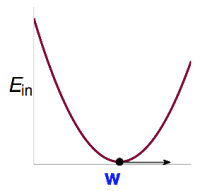
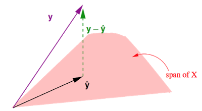
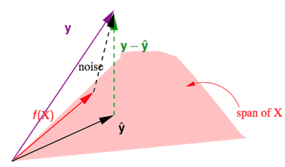
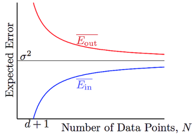

&emsp;&emsp;前面花了很大篇幅在说机器为何能学习，接下来要说的是机器是怎么学习的，进入算法$\mathcal{A}$的部分。[上一篇](http://beader.me/2014/03/02/noise-and-error/)稍微提到了几个error的衡量方式，接下来的几篇笔记要讲的就是各种error measurement的区别以及针对它们如何设计最优化的算法。通过设计出来的算法，使得机器能够从$\mathcal{H}$(Hypothesis Set)当中挑选可以使得cost function最小的$h$作为$g$输出。

&emsp;&emsp;本篇以众所周知的线性回归为例，从方程的形式、误差的衡量方式、如何最小化$E\_{in}$的角度出发，并简单分析了Hat Matrix的性质与几何意义，希望对线性回归这一简单的模型有个更加深刻的理解。

# 方程的形式：

&emsp;&emsp;长得很像perceptron(都是直线嘛)，perceptron是$h(x)=sign(w^Tx)$。

# 误差的衡量 — 平方误差(squared error)：

# Cost function：

&emsp;&emsp;$h(x)$是一个以$x$为变量的方程，而$E\_{in}(w)$变成了一个以$w$为变量的方程。这样一来，我们就把“在$\mathcal{H}$中寻找能使平均误差最小的方程”这个问题，转换为“求解一个函数的最小值”的问题。使得$E\_{in}(w)$最小的$w$，就是我们要寻找的那个最优方程的参数。

# 如何最小化$E\_{in}(w)$：

&emsp;&emsp;用矩阵形式表示：

&emsp;&emsp;$\color{red}{X}$与$\color{purple}{y}$来源于$\mathcal{D}$，是固定不变的，因此它是一个以$\color{blue}{w}$为变量的函数。我们需要解使得$E\_{in}$最小的$\color{blue}{w}$，即$\underset{\color{blue}{w}}{min}\,E\_{in}(\color{blue}{w})=\frac{1}{N}\begin{Vmatrix}\color{red}{X}\color{blue}{w}-\color{purple}{y}\end{Vmatrix}^2$。这个$E\_{in}(\color{blue}{w})$是一个连续(continuous)、处处可微(differentiable)的凸函数(convex)：

   &emsp;&emsp;
  
&emsp;&emsp;对于这一类函数，只需要解其一阶导数为0时的解即可。
  

&emsp;&emsp;关于多元函数的求导，就是线性代数的范畴了：

&emsp;&emsp;所以有：

&emsp;&emsp;令$\nabla E\_{in}(\color{blue}{w})=0$，可得最佳解：

&emsp;&emsp;当$\color{red}{X^TX}$可逆的时候用它作为pseudo-inverse矩阵$\color{red}{X^{\dagger}}$，当$\color{red}{X^TX}$不可逆的时候，再用其他方式定义$\color{red}{X^{\dagger}}$，这里就不详述了。

&emsp;&emsp;用以$\color{blue}{w\_{LIN}}$为参数的线性方程对原始数据做预测，可以得到拟合值$\hat{y}=\color{red}{X}\color{blue}{w\_{LIN}}=\color{red}{XX^{\dagger}}\color{purple}{y}$。这里又称$\color{orange}{H}=\color{red}{XX^{\dagger}}$为Hat Matrix，帽子矩阵，$\color{orange}{H}$为$\color{purple}{y}$带上了帽子，成为$\hat{y}$，很形象吧。

# Hat Matrix 的几何意义

&emsp;&emsp;这张图展示的是在N维实数空间$\mathbb{R}^N$中，注意这里是N=数据笔数，$\color{purple}{y}$中包含所有真实值，$\hat{y}$中包含所有预测值，与之前讲的输入空间是d+1维是不一样的噢。$\color{red}{X}$中包含d+1个column：

 - $\hat{y}=\color{red}{X}\color{blue}{w\_{LIN}}$是$\color{red}{X}$的一个线性组合，$\color{red}{X}$中每个column对应$\mathbb{R}^N$下的一个向量，共有d+1个这样的向量，因此$\hat{y}$在这d+1个向量所构成的$\color{red}{span}$(平面)上。
 - 事实上我们要做的就是在这个平面上找到一个向量$\hat{y}$使得他与真实值之间的距离$|\color{green}{y-\hat{y}}|$最短。不难发现当$\hat{y}$是$\color{purple}{y}$在这个平面上的投影时，即$\color{green}{y-\hat{y}}\perp \color{red}{span}$时，$|\color{green}{y-\hat{y}}|$最短。
 - 所以之前说过的Hat Matrix $\color{orange}{H}$，为$\color{purple}{y}$戴上帽子，所做的就是投影这个动作，寻找$\color{red}{span}$上$\color{purple}{y}$的投影。
 - $\color{orange}{H}\color{purple}{y}=\hat{y}$，$(I-\color{orange}{H})\color{purple}{y}=\color{green}{y-\hat{y}}$。($I$为单位矩阵)

&emsp;&emsp;下面来探究一下$\color{orange}{H}$的性质，这个很重要噢。

$$\text{Hat Matrix }\color{orange}{H} = \color{red}{X(X^TX)}^{-1}\color{red}{X^T}:$$

 - 对称性(symetric)，即$\color{orange}{H}=\color{orange}{H^T}$：

 - 幂等性(idempotent)，即$\color{orange}{H^2}=\color{orange}{H}$：

 - 半正定(positive semi-definite)，即所有特征值为非负数：  
(以下$\lambda$为特征值，$b$为对应的特征向量)

&emsp;&emsp;林老师在课堂上讲到：

$$trace(I-\color{orange}{H}) = N-(d+1)$$

&emsp;&emsp;$trace$为矩阵的迹。这条性质很重要，但是为什么呢？证明过程有点多，以后有机会再补充，心急的同学可以看这里[General formulas for bias and variance in OLS][4]。一个矩阵的$trace$等于该矩阵的所有特征值(Eigenvalues)之和。

&emsp;&emsp;假设$\color{purple}{y}$由$\color{red}{f(X)\in span}+noise$构成的。有$\color{purple}{y}=\color{red}{f(X)}+noise$。之前讲到$\color{orange}{H}$作用于某个向量，会得到该向量在$\color{red}{span}$上的投影，而$I-\color{orange}{H}$作用于某个向量，会得到那条与$\color{red}{span}$垂直的向量，在这里就是图中的$\color{green}{y-\hat{y}}$，即$(I-\color{orange}{H})noise=\color{green}{y-\hat{y}}$。

&emsp;&emsp;这个$\color{green}{y-\hat{y}}$是真实值与预测值的差，其长度就是就是所有点的平方误差之和。于是就有：

&emsp;&emsp;上面的证明不太好整理进来，依然可以参考[General formulas for bias and variance in OLS](http://www.stat.berkeley.edu/~census/general.pdf)。

&emsp;&emsp;因此，就平均而言，有：

&emsp;&emsp;花这么大力气是为了什么，又回到之前learning可行性的话题了。

  

&emsp;&emsp;$\color{red}{\overline{E\_{in}}}$和$\color{blue}{\overline{E\_{out}}}$都向$\sigma ^2$(noise level)收敛，并且他们之间的差异被$\frac{2(d+1)}{N}$给bound住了。有那么点像VC bound，不过要比VC bound来的更严格一些。
