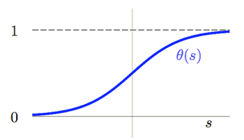
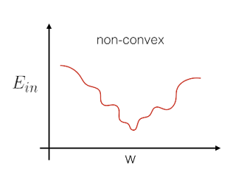
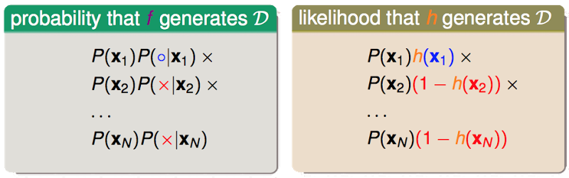
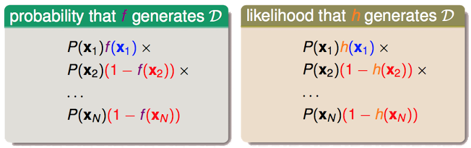
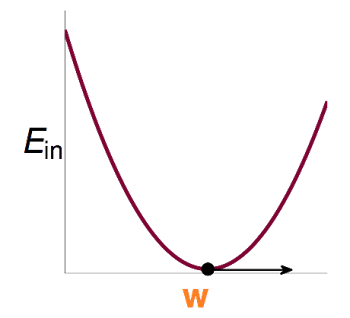
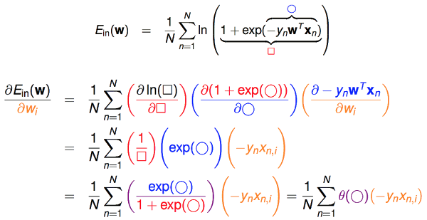
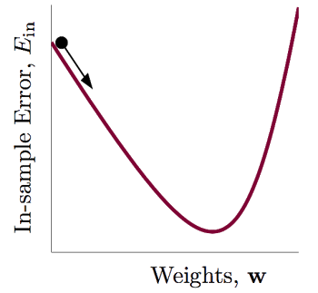
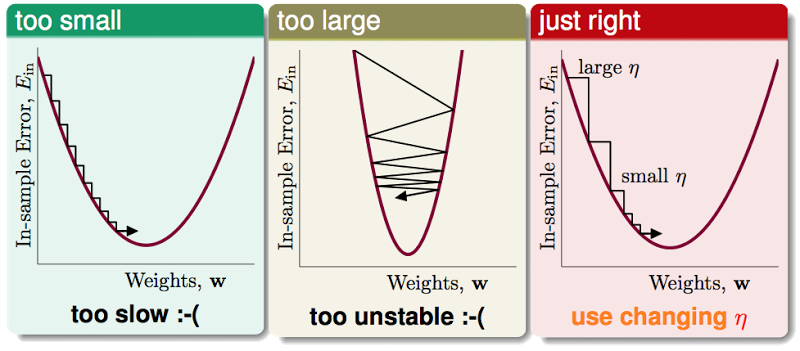

&emsp;&emsp;[上一篇](http://beader.me/2014/03/09/linear-regression/)比较深入地去理解了线性回归的思想和算法。分类和回归是机器学习中很重要的两大内容。而本篇要讲的Logistic Regression，名字上看是回归，但实际上却又和分类有关。

&emsp;&emsp;之前提过的二元分类器如PLA，其目标函数为， $f(x)=sign(w^Tx)\in\{-1,+1\}$，输出要么是-1要么是+1，是一个“硬”的分类器。而Logistic Regression是一个“软”的分类器，它的输出是$y=+1$的概率，因此Logistic Regression的目标函数是 $\color{purple}{f}(x)=\color{orange}{P(+1|x)}\in [0,1]$。

## 方程的形式

&emsp;&emsp;上面的方程背后有什么逻辑呢？

&emsp;&emsp;假设医院知道一个病人的年龄、性别、血压、胆固醇水平，可以为他计算他得某种病的概率。最简单的做法就是对这几个特征进行加权求和：

&emsp;&emsp;但这里有个问题，就是 $\color{purple}{s}$ 的取值范围是$[-\infty,+\infty]$，而我们希望输出的是对该病人患病概率的一个估计，就需要把输出空间$[-\infty,+\infty]$转换到$[0,1]$上。如何变换？通过sigmoid函数 $\color{blue}{\theta}$ 。

$$\color{blue}{\theta}(\color{purple}{s})=\frac{e^\color{purple}{s}}{1+e^\color{purple}{s}}=\frac{1}{1+e^\color{purple}{-s}}$$

&emsp;&emsp;因此，我们就可以利用经过sigmoid变换后的方程来对患病概率进行一个估计。

## 误差的衡量 - Cross Entropy Error

&emsp;&emsp;有了方程的形式，我们就需要一个误差的衡量方式。[上一篇](http://beader.me/2014/03/09/linear-regression/)我们讲到Linear Regression所使用的是平方误差，那么Logistic 可以使用平方误差吗？当然可以，error是人定的，你爱怎么定就怎么定，但是使用平方误差好不好，不好。为什么呢？

&emsp;&emsp;如果使用平方误差，每个点产生的误差是：

&emsp;&emsp;此时cost function，$E\_{in}(w)=\sum{err}$就是一个关于$w$的非凸函数(non-convex)：

&emsp;&emsp;非凸函数由于存在很多个局部最小点，因此很难去做最优化(解全局最小)。所以Logistic Regression没有使用平方误差来定义error，而是使用极大似然法来估计模型的参数。那么我们就要先来了解一下这个似然性(likelihood)。
&emsp;&emsp;Logistic Regression的目标函数的输出是，在已知$x$的条件下，$y=+1$的概率，因此在已知$x$的条件下，$y=+1$的概率是$f(x)$，$y=-1$的概率是$1-f(x)$:

&emsp;&emsp;考虑我们的训练样本$\mathcal{D}=\{(x\_1,\color{blue}{+1}),(x\_2,\color{red}{-1}),...,(x\_N,\color{red}{-1})\}$，并不是每次抽样都能抽到一模一样的$\mathcal{D}$，抽到这么一份样本是由于各种的机缘巧合。那么我们能抽到这么一份$\mathcal{D}$的概率取决于两部分：1、抽到样本$x\_1,...,x\_N$的概率；2、这些样本对应的$y\_1,...,y\_N$等于$\color{red}{+1}$的概率。

&emsp;&emsp;对于目标函数 $\color{purple}{f}$，抽到$\mathcal{D}$的概率只取决于第1部分，而我们无法知道 $\color{purple}{f}$，即第2部分也是未知的，因此我们称在 $\color{orange}(h)$的作用下抽出$\mathcal{D}$的概率为“似然性”。如果 $\color{orange}{h}\approx\color{purple}{f}$，则 $likelihood(\color{orange}{h})\approx \text{probability using }\color{purple}{f}$，并且我们认为在 $\color{purple}{f}$的作用下，产生$\mathcal{D}$这样的样本的概率通常是非常的大的。

&emsp;&emsp;所以有：

$$\text{if } \color{orange}{h}\approx\color{purple}{f}\text{, then }\; likelihood(\color{orange}{h})\approx(\text{probability using }\color{purple}{f})\approx\color{purple}{\text{large}}$$

&emsp;&emsp;则理想的hypothesis就是能使得似然函数最大的那个$h$：
$$g=\underset{\color{orange}{h}}{argmax}\;likelihood(\color{orange}{h})$$

&emsp;&emsp;当$\color{orange}{h}$是logistic函数的时候，即$h(x)=\theta(w^Tx)$，由于logistic函数的中心对称性，有:
$$1-h(x)=h(-x)$$

&emsp;&emsp;所以有:

&emsp;&emsp;因此有这么一个相似性:

$$likelihood(logistic\;\color{orange}{h})\propto \prod_{n=1}^{N}\color{orange}{h}(y_nx_n)$$

&emsp;&emsp;我们的目标是想找到一个似然性最大的方程:

$$\underset{\color{orange}{h}}{max}\;\;\color{grey}{likelihood(logistic\;\color{orange}{h}) \propto}\prod_{n=1}^{N}\color{orange}{h}(y_nx_n)$$

&emsp;&emsp;转化成与参数$w$有关的形式:

&emsp;&emsp;求解上式最大值，等价于求解下式的最小值:

&emsp;&emsp;求和符号后面的部分就是在极大似然估计下，logistic方程的误差函数，这种形式的误差函数称为cross entropy error:

$$err(\color{orange}{w},x,y)=ln(1+exp(-y\color{orange}{w}x))\\\
\color{blue}{\text{cross-entropy error}}$$

## Cost function

&emsp;&emsp;有了误差函数后，我们就可以定出Cost function:

&emsp;&emsp;该函数是连续，可微，并且是凸函数(二次微分矩阵是正定的)。

## 如何最小化$E\_{in}(w)$

&emsp;&emsp;那么如何能够最小化$E\_{in}(w)$呢？按照之前Linear Regression的逻辑，由于它是凸函数，如果我们能解出一阶微分(梯度)为0的点，这个问题就解决了。

&emsp;&emsp;先来看看$E\_{in}(w)$在$w\_i$方向上的偏微分：

&emsp;&emsp;再把偏微分方程中的$x\_{n,i}$换成向量的形式，就得到$E\_{in}(w)$的一阶微分:

&emsp;&emsp;和之前的Linear Regression不同，它不是一个线性的式子，要求解$\triangledown E\_{in}(w)=0$这个式子，是困难的。那么该使用何种方法实现$E\_{in}(w)$最小化呢？

&emsp;&emsp;这里可以使用类似[PLA](http://beader.me/2013/12/21/perceptron-learning-algorithm/)当中的，通过迭代的方式来求解，这种方法又称为梯度下降法(Gradient Descent)。

&emsp;&emsp;For t = 0, 1, ...
$$w_{t+1} \leftarrow w_t + \color{red}{\eta}\color{blue}{v}$$
&emsp;&emsp;when stop, return $\color{purple}{\text{last w as g}}$

&emsp;&emsp;其中$\color{red}{\eta}$为每步更新的大小(step size)，$\color{blue}{v}$是单位向量，表示每次更新的方向。

&emsp;&emsp;有点类似一个小球，往山谷方向滚，直至山谷。每一步我们只要决定两个东西：1、滚动的方向；2、滚动的步长。

&emsp;&emsp;滚动的方向好决定，即在该点一阶微分后的向量所指的方向：

&emsp;&emsp;步长 $\color{red}{\eta}$比较难决定，太小了，更新太慢，太大了，容易矫枉过正:

&emsp;&emsp;一个比较好的做法是让 $\color{red}{\eta}$ 与 $\color{blue}{||\triangledown E\_{in}(w\_t)||}$ 成一定的比例，让新的和$\color{blue}{||\triangledown E\_{in}(w\_t)||}$成比例的$\color{purple}{\text{紫色的 }\eta}$ 来代替原来$\color{red}{\text{红色的 }\eta}$：

&emsp;&emsp;我们称这个$\color{purple}{\text{紫色的 }\eta}$ 为 $\color{purple}{\text{fixed learning rate}}$。

&emsp;&emsp;再来完整的梳理下梯度下降法(Gradient Descent):

&emsp;&emsp;initialize $w\_0$

&emsp;&emsp;For t = 0, 1, ...
    
&emsp;&emsp;1. compute

&emsp;&emsp;2. update by

&emsp;&emsp;...until $\color{orange}{E\_{in}(w\_{t+1})=0}$ or enough iterations

&emsp;&emsp;return $\color{purple}{\text{last }w\_{t+1}\text{ as }g}$
